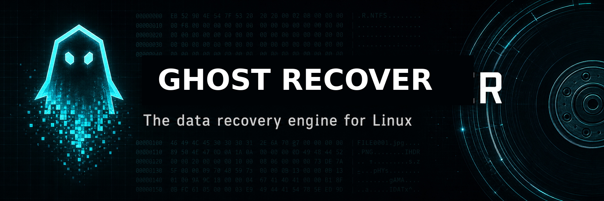
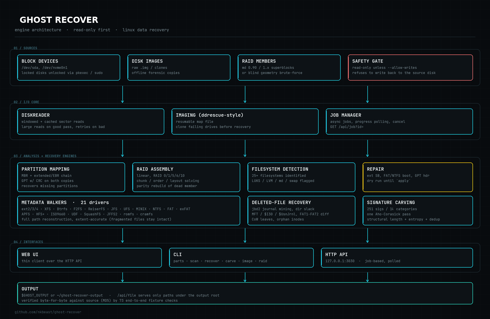
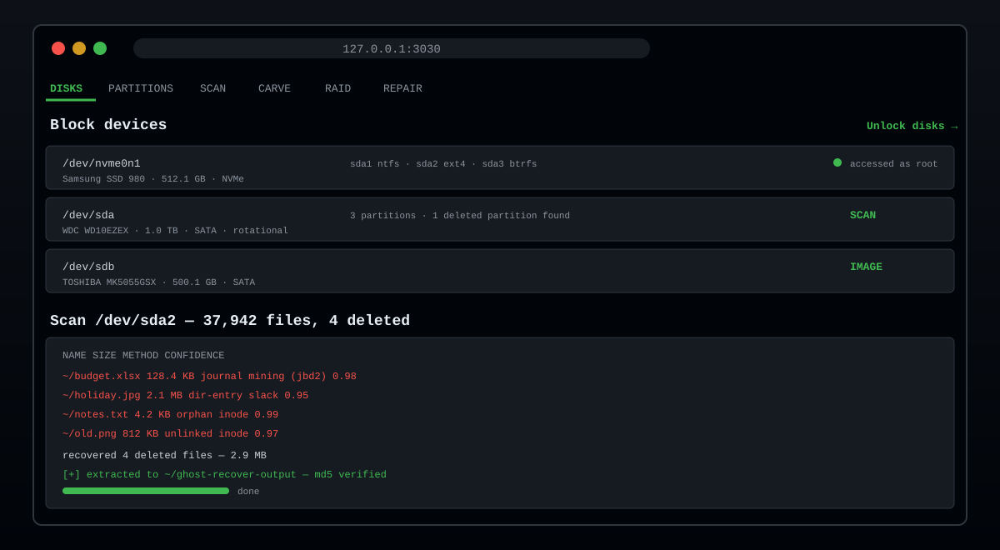

<p align="center">
  
</p>

<h1 align="center">GHOST RECOVER — Linux Data Recovery Tool</h1>

<p align="center">
  <b>Recover deleted files, carve lost photos and documents from RAW disks, reassemble RAID
  arrays, clone failing hard drives and repair damaged filesystems</b> — a read-only-first,
  open-source <i>data recovery software for Linux</i> with a web interface, CLI and HTTP API.
</p>

<p align="center">
  <a href="LICENSE"></a>
  
  
  
  <a href="https://github.com/nkbeast/ghost-recover/actions/workflows/ci.yml"></a>
  <a href="https://github.com/nkbeast/ghost-recover/releases"></a>
  <a href="https://github.com/nkbeast/ghost-recover/stargazers"></a>
</p>

<p align="center">
  <b>Free &amp; open source</b> &nbsp;·&nbsp; no mounting, no root required for images &nbsp;·&nbsp; runs
  smoothly on low-end hardware (1 GiB RAM) &nbsp;·&nbsp; every technique verified byte-for-byte
</p>

---

## What is GHOST RECOVER?

GHOST RECOVER is an **all-in-one data recovery suite for Linux** that recovers what other tools
miss. It combines every professional technique in one engine:

* **📁 Filesystem recovery &amp; deleted-file recovery** — walks the raw metadata of **44 filesystems**
  (ext2/3/4, XFS, Btrfs, NTFS, FAT32, exFAT, APFS, HFS+, ISO 9660, UDF and more) to reconstruct
  full directory paths and find deleted files — from the journal, orphan inodes, directory slack,
  MFT slack and FAT1/FAT2 differencing, not just "scan free space".
* **🔍 RAW disk carving (data carving)** — recovers **262 file formats across 14 categories**
  (JPEG, PNG, RAW photos, videos, documents, archives, email, databases and more) with a single
  Aho-Corasick pass, structural length validation and content-hash deduplication.
* **🔀 RAID recovery** — reassembles RAID 0, RAID 1, RAID 5, RAID 6, RAID 10 and linear arrays
  from md superblocks *or* blind geometry detection, and **rebuilds a missing member from parity**.
* **💾 Hard drive imaging** — ddrescue-style cloning of failing disks with a resumable map file
  and bad-sector retries.
* **🛠️ Filesystem repair** — restores ext/FAT/NTFS boot regions and GPT headers from backups,
  always a dry run until you say `apply`.
* **🧠 Optimised for low-end devices** — RAM-aware design: candidate limits, caches and thread
  pools scale with installed memory, jobs run one at a time in a fair queue, and the progress bar
  reports honest byte- and candidate-based percentages. **Runs comfortably on a 1 GiB RAM machine.**

> **Everything is read-only unless you explicitly start the engine with `--allow-writes`.**
> GHOST RECOVER **refuses to write recovered data back onto the disk it came from** — that is how
> recovery attempts destroy the data they're trying to save.

---

## 🚀 Quick start

### Build

Requires a C++17 compiler and CMake &ge; 3.16. zlib is optional (enables SquashFS/cramfs/JFFS2
decompression); zstd is too (enables Btrfs zstd extents).

```sh
git clone https://github.com/nkbeast/ghost-recover
cd ghost-recover
cmake -S . -B build -DCMAKE_BUILD_TYPE=Release
cmake --build build -j
```

### Run

```sh
./build/ghost_recover            # opens the web interface in a browser
./build/ghost_recover --help     # command-line usage
```

Reading a physical disk needs root. If you pick a locked disk, the interface offers to unlock it:
it launches a privileged copy of itself and hands over the port, so the browser reconnects to the
same page with full disk access. It prefers **pkexec** (your desktop's own authentication dialog —
the password never passes through this program); where polkit is unavailable it falls back to a
sudo password, used once and never stored.

```sh
sudo ghost_recover parts   /dev/sda --deep      # partitions, incl. deleted ones
sudo ghost_recover scan    /dev/sda2 --deleted  # list deleted files
sudo ghost_recover recover /dev/sda2 --out ~/rescued
sudo ghost_recover carve   /dev/sda2 --out ~/carved --categories image,document
sudo ghost_recover image   /dev/sdb  --out ~/sdb.img     # clone a failing drive
     ghost_recover raid    m0.img m1.img m2.img --out ~/array.img
```

Recovered files go to `$GHOST_OUTPUT`, or `~/ghost-recover-output`.

---

## How it works

<p align="center">
  
</p>

Three complementary passes make sure nothing is missed:

1. **Filesystem metadata walk** — reads the live (and deleted) structures of the filesystem to
   rebuild the directory tree exactly as it was.
2. **Signature carving** — a byte-level sweep that finds files by their content, which works even
   when the filesystem is gone, formatted over, or corrupted.
3. **Partition &amp; geometry recovery** — finds lost partitions and works out RAID geometry when
   metadata is destroyed.

---

## 📁 Filesystem recovery (44 filesystems)

**44 filesystems and containers** are identified; **20 families** are walked with full metadata
drivers (each covering its sub-variants):

| Family | Filesystems |
|---|---|
| Linux | ext2/3/4, XFS, Btrfs, F2FS, ReiserFS, JFS, MINIX, UFS/UFS2, romfs, cramfs |
| Windows | NTFS, FAT12/16/32, VFAT, exFAT |
| Apple | APFS, HFS+/HFS/HFSX |
| Optical | ISO 9660 (Joliet + Rock Ridge), UDF |
| Embedded | SquashFS, JFFS2 |

ZFS is parsed at the vdev-label / uberblock level and reported honestly — file-level recovery
would need a full DMU traversal, so the engine says so instead of pretending, and points at
`zpool import -o readonly=on` or signature carving as the working alternatives. A further 16
filesystems and containers — BCachefs, NILFS2, EROFS, UBIFS, YAFFS2, OCFS2, GFS2, SysV, Xiafs,
Reiser4, Linux swap, LUKS, LVM2, md RAID, VMFS and ReFS — are identified so the tool can tell
you what you are actually looking at.

Every driver reconstructs **full paths** and describes files as **extent lists**, so **fragmented
files come out intact**, not corrupted.

## 🕵️ Recover deleted files

Each filesystem gets the techniques that actually apply to it:

| Filesystem | Techniques |
|---|---|
| ext2/3/4 | deleted inodes (`i_dtime`), **jbd2 journal mining** for extent trees that `unlink()` cleared, directory-entry slack, orphan inode list, backup superblocks |
| NTFS | unused MFT records, `$I30` index slack, `$UsnJrnl` change journal, `$MFTMirr` and backup-boot-sector fallbacks, alternate data streams |
| FAT/VFAT | `0xE5` entries, long-name reassembly, **first-character recovery from the LFN checksum**, FAT1/FAT2 differencing, directory slack, orphaned cluster chains |
| exFAT | directory entry sets with the in-use bit cleared, contiguous-stream reconstruction |
| Btrfs / APFS | copy-on-write leaves from superseded generations |
| XFS | inodes in released B+tree slots |
| F2FS | obsolete node blocks left by the log-structured writer |
| UFS/UFS2 | orphan inodes in the live cylinder groups |
| SquashFS | orphan-inode scan of the metadata tables |
| JFFS2 | dinode signature scan of dead blocks |
| ReiserFS | unlinked inodes swept from released leaf nodes |

## 🪓 RAW file carving (262 formats)

**262 signatures across 14 categories**, matched with a **single Aho-Corasick pass** over the
device rather than one search per signature.

Formats that describe their own length (JPEG, PNG, GIF, TIFF, RIFF, MP4/ISO-BMFF, EBML, Ogg,
FLAC, MP3, AAC, AC-3, MPEG PS/TS, FLV, ASF, ZIP, 7z, RAR, tar, ar, CAB, SQLite, ELF, PE, Mach-O,
pcap/pcapng, EVTX, registry hives, OLE2, PDF, fonts, WASM, DEX and more) are **walked
structurally**, so files come out at their **true size** instead of a fixed guess.

Results are **entropy-screened** (junk false positives get rejected), **deduplicated by content
hash**, and can be restricted to the volume's free space — perfect for **photo recovery**, video
recovery and document recovery from formatted cards and drives.

## 💽 Partition recovery

* MBR including the extended/EBR chain
* GPT with CRC validation of both copies
* **Recovery of partitions missing from the table** by scanning for filesystem superblocks and
  volume boot records — the tool recreates deleted partitions from raw disk data.

## 🔀 RAID recovery

* Reads Linux md superblocks (**0.90 and 1.x**)
* Or works out **chunk size, member order and parity layout** when they are gone — each guess
  checked by following the filesystem's own pointers deep into the assembled array, ranked by how
  much end-to-end verifiable content each reconstructs
* Maps **linear, RAID 0/1/5/6/10**, and **rebuilds a missing member from parity**

A chunk size of N and N/2 map the *start* of an array identically, so on an array holding little
data the geometry can be genuinely undecidable. In that case the engine **says so** — it reports
the alternatives and a low confidence rather than presenting a guess as a finding.

```sh
ghost_recover raid m0.img m1.img missing m3.img \
    --level 5 --chunk 65536 --layout left-symmetric --out array.img
```

## 💾 Hard drive imaging &amp; bad-sector cloning

ddrescue-style cloning with a **resumable map file**, large reads on the good pass and
sector-by-sector retries over the bad areas. Image a dying drive first, then recover from the
clone — your data stays safe.

## 🛠️ Filesystem repair

Restores ext superblocks, FAT/exFAT boot regions, NTFS boot sectors and GPT headers from their
backups, and can rebuild an MBR from recovered partitions. Every repair is a **dry run** unless
you pass `apply`, and the original sectors are saved first.

---

## 🖥️ Web interface

<p align="center">
  
</p>

The interface is a thin client over an HTTP API on `127.0.0.1:3030`. Long operations return a job
id and are polled — with a **live, honest progress bar** (bytes scanned, candidates validated,
files recovered):

```
GET  /api/health /api/disks /api/filesystems /api/carvers /api/browse
GET  /api/privileges  POST /api/elevate  GET /api/elevate/status
POST /api/handover (privilege hand-off)     POST /api/shutdown
POST /api/detect /api/partitions
POST /api/scan /api/carve /api/deep /api/extract /api/image        -> { job }
GET  /api/job?id= /api/jobs        POST /api/job/cancel
GET  /api/results?job=&offset=&limit=&q=&ext=&only=&sort=
GET  /api/content?job=&index=[&max=]   /api/hex   /api/fileinfo   /api/file
POST /api/raid/detect /api/raid/assemble /api/repair /api/save
```

Files preview in place: images, audio and video play directly in the page, PDFs render in an
iframe, and unknown formats fall back to a hex viewer — all served from `/api/content`. Plain
files stream window-by-window and answer HTTP Range requests natively, so players can seek
through multi-gigabyte files without loading them; an optional `max=` bounds a preview's byte
budget (the response carries `X-Content-Truncated: 1` when a cap applies), while downloads
always receive the complete file.

`/api/file` only serves paths under the output root; the engine will not read arbitrary files off
the host.

---

## 🛡️ Working safely

* **Never write recovered files back to the disk you are recovering from.** Doing so overwrites
  the free space still holding the rest of your data. The engine **refuses this outright** — for
  recovery, carving and imaging — rather than warning about it.
* If a drive is making noises or throwing I/O errors, **clone it first** (`ghost_recover image`)
  and recover from the clone.
* Repairs modify the device. Every repair is a dry run unless you pass `apply`, and the original
  sectors are saved first, but **image the disk anyway**.

---

## 📊 How does it compare?

| | GHOST RECOVER | TestDisk | PhotoRec | ddrescue |
|---|---|---|---|---|
| Deleted-file recovery | ✅ journal + slack + orphan scans | ✅ partition/entry-level | partial (carve only) | — |
| RAW signature carving | ✅ 262 formats, structural validation | — | ✅ (~500 formats) | — |
| Recovered file integrity | ✅ **byte-for-byte verified**, content-hash dedup | raw entries | raw bytes | raw bytes |
| RAID reassembly | ✅ 0/1/5/6/10 + parity rebuild | ✅ (basic) | — | — |
| Failing-drive imaging | ✅ resumable map | — | — | ✅ |
| Filesystem repair | ✅ dry-run + backup sectors | ✅ | — | — |
| Interface | ✅ web UI + CLI + API | CLI | CLI | CLI |
| Low-RAM operation | ✅ 1 GiB RAM | ✅ | ✅ | ✅ |

---

## 🧪 Testing &amp; verification

```sh
./tests/verify.sh        # end-to-end fixtures: 88 automated checks
./tests/verify.sh /tmp/ghost-fixtures   # reuse a previously built fixture set
```

**88 automated checks, 0 failures.** Builds real ext4/ext2/NTFS/FAT32/exFAT/Btrfs/XFS/ISO/UDF/
SquashFS/cramfs/MINIX/JFFS2 filesystems from a known corpus (no mounting, no root), deletes files
from some of them, then checks that the engine identifies each filesystem, finds the deleted
files, and writes every recovered file back out **byte-for-byte identical** to the original —
verified by **MD5, not by the engine's own reporting**. The Btrfs fixture rewrites real extents
as compressed ones (inline zlib/lzo/zstd, regular zlib extents) and the NTFS fixture stores one
file as an LZNT1 stream, so the compressed-content paths are proven against the same corpus, not
against the engine's own output.

Also covered: MBR logical partitions, partition recovery after wiping both GPT copies, RAID 0/5
geometry recovery from data alone, parity rebuild of a destroyed member, superblock repair (dry
run vs. apply), bad-sector imaging, the refusal to write onto the source disk, and corrupt /
truncated / random images handled without crashing or being misidentified.

Static analysis runs in CI-style fashion via clang-tidy with the `bugprone*`,
`clang-analyzer*` and `misc-const-correctness` groups:

```sh
run-clang-tidy -p build src/
```

The suite also runs under **ASan/UBSan** — this tool parses hostile on-disk structures for a
living, so memory safety is tested, not assumed.

---

## ❓ FAQ

**What can I recover with GHOST RECOVER?**
Deleted files, formatted partitions, lost photos/videos/documents from RAW-scanned disks, RAID
arrays whose metadata is gone, and files off failing drives you first clone to an image.

**Does it work if the filesystem is damaged or was formatted over?**
Yes — signature carving works on raw bytes and does not need a filesystem at all. Combine it with
the filesystem walk when metadata still exists for the most complete result.

**Is it safe? Will it overwrite my data?**
The engine is read-only-first and *refuses* to write recovered data onto the source disk. Repairs
are dry runs by default and the original sectors are saved first.

**Do I need root?**
Only to read physical block devices. Images, USB sticks and other files can be scanned with no
elevation at all.

**Can it run on an old low-RAM machine?**
Yes — the engine is deliberately RAM-aware: thread pools, caches and candidate limits scale with
installed memory, and it runs comfortably on 1 GiB.

**Is it free?**
Yes — MIT licensed, free and open source. No accounts, no trials, no telemetry.

---

## 📁 Project layout

```
include/ghost/   types, I/O, JSON, filesystem, carving, disk, recovery, server headers
src/core/        windowed and cached DiskReader, JSON, hashing, job manager
src/fs/          detection and one file per filesystem family
src/carve/       Aho-Corasick matcher, signature registry, carving engine
src/disk/        device enumeration, partition tables, RAID
src/recover/     extraction, repair, imaging
src/server.cpp   HTTP API
web/             interface (index.html, app.js, styles.css)
tests/           fixture builder and end-to-end verification
```

---

## 🧭 Roadmap

* NTFS LZX / XPRESS content decompression
* Real-world recovery fidelity tests beyond synthetic fixtures
* Forensics extras: PST/Outlook, browser artifacts, deeper Windows app-data coverage
* Windows and macOS builds
* Bad-block retry heuristics (multi-pass like ddrescue)

*Contributions toward any of these are very welcome.*

---

## 🤝 Contributing

1. Fork it.
2. Create your feature branch: `git checkout -b feat/my-feature`
3. Commit your changes: `git commit -am 'Add my feature'`
4. Push to the branch: `git push origin feat/my-feature`
5. Open a pull request — CI builds and runs the full verification suite automatically.

Before opening a PR, make sure `./tests/verify.sh` passes locally.

---

## 📄 License

[MIT](LICENSE) &copy; 2026 Naveenkumar D. The vendored [cpp-httplib](https://github.com/yhirose/cpp-httplib)
keeps its own MIT notice.
